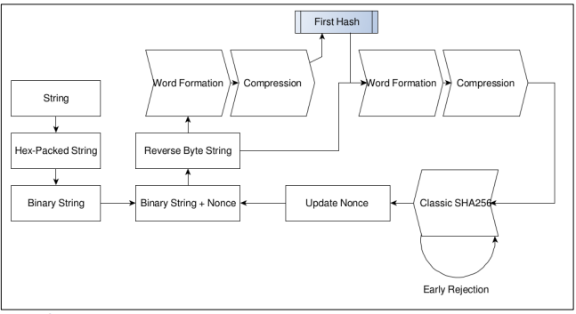
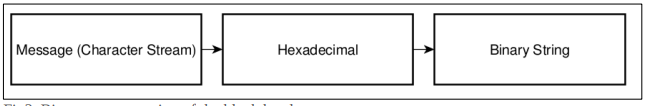
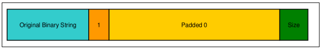
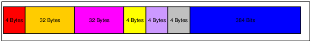
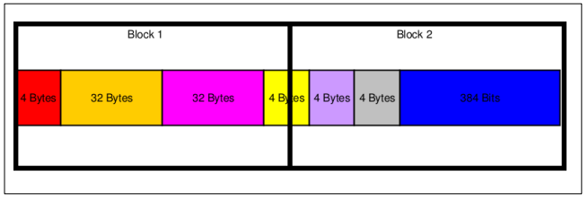
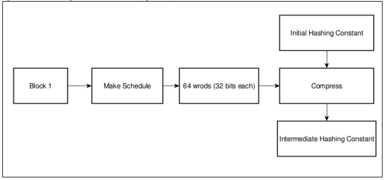
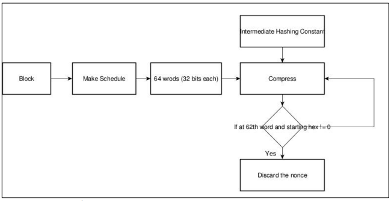

# Effective Nonce Finder for SHA-256

## Tree Structure

```
.
├── in.dat
├── include
│   ├── blockHash.h
│   ├── operation.h
│   └── sha.h
├── src
│   ├── blockHash.cpp
│   ├── operation.cpp
│   └── sha.cpp
├── testClassic.cpp
├── testOpt.cpp
└── README.md
```

## Testing

### Using Classic Method

```
g++ testClassic.cpp ./src/* -o testClassic.out  
./testClassic.out < in.dat
```

### Using Optimised Method

```
g++ testOpt.cpp ./src/* -o testOpt.out  
./testOpt.out < in.dat
```

## Architecture



## Algorithm

Block Header Formation The miner forms a valid block header by selecting valid transactions from the transaction pool using a working bitcoin node. The formed block header must not include any nonce value bits.

1. **Passing Block Header to Hashing Library:** The formed block header is passed to the hashing library as a stream of characters, following the reverse byte order or little-endian format, which is the standard for the bitcoin network.

2. **Hex-Packing and Binary Conversion:** The passed stream of characters is hex-packed and then converted into binary format since most hashing functions operate on bitwise operations. Although binary values are handled as binary internally in the library, initially the library forms a binary string to make block formation and scheduling faster and easier.


3. Add ‘1’ at the end of the binary string and make the size of binary string 64 less than the closest multiple of 512 by padding ‘0’ after the added 1. Finally make the entire binary string a multiple of 512 by filling the last 64 bits with the original size of the binary string (in 64 bit binary)



4. Divide the Final string in Blocks of 512 bits. The nonce value will be formed in the second block, and hence we will not compute it repeatedly.


5. For the first Block, we will form the message schedule and compress the word which will update the hashing constants value. We will store this value to avoid further re-computing it for different nonce.


6. Second Block will pick up the hashing constants from the first block and continue the hashing for different values of nonce. After block 2’s compression, we will have our first Hash, but since for SHA256, we cannot predict the change in the hash for a change in the nonce, we will have to move towards the classical method
of computing SHA256 for this hash.

7. We can reject rounds a few compressions before (for the word 62), since with today’s mining difficulty, the final hash needs to have atleast 10 zeros, we are no longer required to compute the starting constants if the third constant does not start with a 0.
